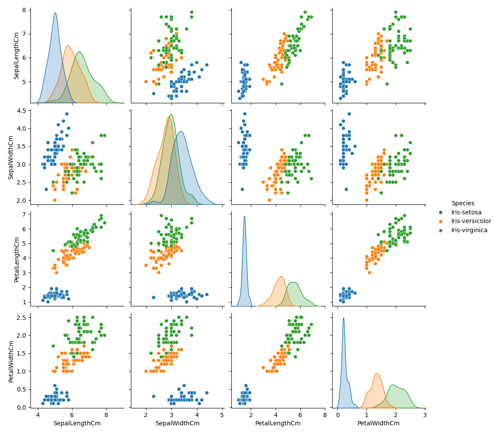
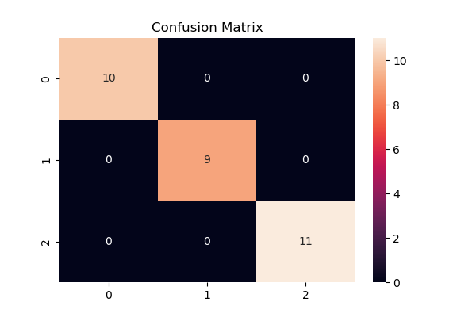
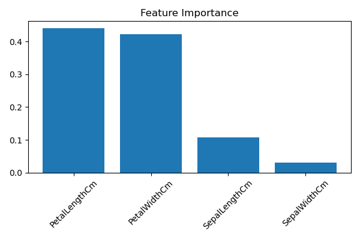

# 🌸 Iris Flower Classification using Machine Learning


# 📌 Project Overview

This project was developed as part of the **CodeAlpha Data Science Internship**.

The goal of this project is to build a Machine Learning model capable of classifying Iris flowers into three species based on their flower measurements.

### 🌼 Iris Species

- Iris Setosa
- Iris Versicolor
- Iris Virginica

The classification is performed using the following flower measurements:

- Sepal Length
- Sepal Width
- Petal Length
- Petal Width

---

# 🎯 Objectives

- Perform data loading and preprocessing.
- Explore and visualize the Iris dataset.
- Train a Machine Learning classification model.
- Evaluate model performance.
- Predict flower species based on measurements.
- Understand the complete Machine Learning workflow.

---

# 📂 Dataset Information

The dataset contains **150 samples** and **5 columns**.

| Feature | Description |
|----------|------------|
| SepalLengthCm | Length of sepal |
| SepalWidthCm | Width of sepal |
| PetalLengthCm | Length of petal |
| PetalWidthCm | Width of petal |
| Species | Target Variable |

## Target Classes

- Iris-setosa
- Iris-versicolor
- Iris-virginica

---

# 🛠️ Technologies Used

- Python
- Pandas
- NumPy
- Matplotlib
- Seaborn
- Scikit-Learn
- Joblib

---

# 📊 Machine Learning Workflow

Data Collection → Data Cleaning → EDA → Visualization → Train/Test Split → Model Training → Evaluation → Prediction

---

# 🤖 Machine Learning Model

## Random Forest Classifier

Reasons for using Random Forest:

- High Accuracy
- Reduces Overfitting
- Handles Feature Relationships Well
- Easy to Implement

---

# 📈 Exploratory Data Analysis

### Dataset Preview

```python
df.head()
```

### Missing Values Check

```python
df.isnull().sum()
```

### Dataset Statistics

```python
df.describe()
```

---

# 📷 Visualizations

## Pair Plot



---

## Confusion Matrix



---

## Feature Importance



---

# 📋 Model Evaluation

Metrics Used:

- Accuracy Score
- Classification Report
- Confusion Matrix

Example:

```text
Accuracy: 0.97
```

The model achieves approximately **96%–100% accuracy**.

---

# 🔮 Sample Prediction

Input:

```python
[[5.1, 3.5, 1.4, 0.2]]
```

Output:

```text
Iris-setosa
```

---

# 📁 Project Structure

```text
CodeAlpha_Iris_Flower_Classification
│
├── Iris.csv
├── iris_classification.py
├── iris_model.pkl
├── requirements.txt
├── README.md
│
└── screenshots
    ├── pairplot.png
    ├── confusion_matrix.png
    └── feature_importance.png
```

---

# ⚙️ Installation

```bash
git clone https://github.com/vansh3452/CodeAlpha_Iris_Flower_Classification.git
cd CodeAlpha_Iris_Flower_Classification
pip install -r requirements.txt
python iris_classification.py
```

---

# 🚀 Future Improvements

- Deploy with Streamlit
- Build Web Application Interface
- Hyperparameter Tuning
- Compare Multiple Models
- Cloud Deployment

---

# 🧠 Key Learnings

- Data Preprocessing
- Data Visualization
- Feature Engineering
- Classification Algorithms
- Model Evaluation
- Machine Learning Workflow

---

# 📜 Internship Task

**CodeAlpha Data Science Internship**

Task 1: Iris Flower Classification

---

# 👨‍💻 Author

**Vansh Gupta**

Data Science Intern @ CodeAlpha

GitHub: https://github.com/vansh3452

LinkedIn: https://www.linkedin.com/in/vansh-gupta-6465a23a8?

---

⭐ If you found this project useful, consider giving it a star.
